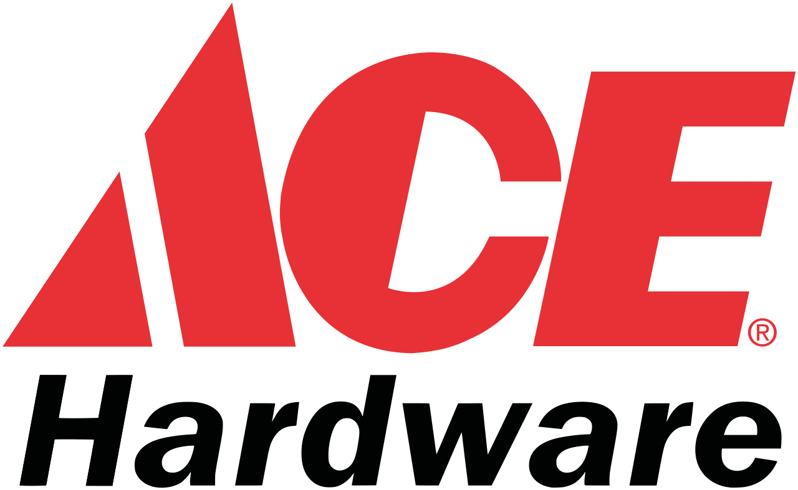

    
    <a href="#english">English</a>
    ·
    <a href="#spanish">Spanish</a>
    ·
    <a href="#portuguese">Portuguese</a>
    ·
    <a href="#chinese">Chinese</a>

 

### MINILIFT-DIY BUSINESS PITCH 
Summary of the 2020 fundraising roadshow.  

**THE OPPORTUNITY AND THE PROPOSAL**  
Companies a

**BUSINESS AND EXECUTION**  
The innovative 

**FINANCING**  
All expansion 1

...

*1. The "Non Disclousure Agreement" for access to the business plan's **executive summary** is available to investors interested in <a href="http://bit.ly/NDA-OpenPBL">MiniliftDIY NDA</a>.*

 

    
    <a href="#english">English</a>
    ·
    <a href="#spanish">Spanish</a>
    ·
    <a href="#portuguese">Portuguese</a>
    ·
    <a href="#chinese">Chinese</a>

##  
                         
                         

 
 

### MINILIFT-DIY - PRESENTACIÓN DE IDEA DE NEGOCIO
Resumen del roadshow de recaudación de fondos de 2020.

**...**

(Pronto también disponible en la versión en español)
...

*1. El "Acuerdo de no divulgación" para el acceso al **resumen ejecutivo** del plan de negocios está disponible para inversores interesados en <a href="http://bit.ly/NDA-OpenPBL">MiniliftDIY NDA</a>.*

 

    
    <a href="#english">English</a>
    ·
    <a href="#spanish">Spanish</a>
    ·
    <a href="#portuguese">Portuguese</a>
    ·
    <a href="#chinese">Chinese</a>

##  
                         
                         

 
 

### MINILIFT-DIY - IDEIA 

**A oportunidade e a proposta**  
A empresa Exxponential LLC importa e instala nos USA a **MiniLift**, uma linha de elevadores de duas paradas **revolucionária** por sua **simplicidade**, **eficácia** de operação, **consumo** de energia e baixo **impacto ao meio ambiente**.

A empresa tem encontrado uma aceitação muito boa do produto no mercado americano, o que pode ser comprovado com um indicador NPS acima de 8 entre seus clientes. 

<table style="width:100%">
  <tr>
    <th></th> 
    <th></th> 
  </tr>
</table>

<em><a href="https://youtu.be/WyKZC7nhQZw">Vídeo</a> do funcionamento do MiniLift Nano.</em>

 

A boa receptividade do MiniLift nos USA é explicada por diversos fatores, entre eles: (1) seu **baixo preço** e simplicidade (2) a boa dispersão da população de classe média; (3) a alta incidência de casas de dois andares e; (4) um pujante mercado de **acessibilidade** individual, puxado, sobretudo, por idosos e portadores de deficiência, entre estes, os veteranos de guerra. 

Todos esses fatores apontam para um crescimento promissor da Exxponential e uma crescente **popularização do conceito** de acessibilidade da linha MinniLift nos próximos anos. Entretanto, após o primeiro ano de operação nos USA, os empreendedores à frente do negócio constataram que uma parte significativa do preço final do equipamento é resultado do custo agregado para a instalar o equipamento. Trata-se de uma operação bastante rápida e simples, mas que frequentemente exige alguma **complexidade logística** porque emvolve **deslocamentos**, despesas com **hospedagem** e **mão de obra especializada**.

Por outro lado, o mercado americano é bastante receptivo ao conceito “**Do It Yourself (DIY)** ”, no qual o próprio cliente monta e instala um determinado equipamento, quase sempre em troca da redução do preço do mesmo equipamento quando montado e instalado por terceiros. 

Diante deste cenário, os idealizadores do **projeto Minilift DIY** viram-se diante de uma excelente oportunidade de negócios. Ao longo dos últimos meses, eles pesquisaram e encontraram formas viáveis de **adaptar o projeto atual** da linha MiniLift para a modalidade DIY e, assim, reduzir consideravelmente o preço do equipamento ao consumidor final.  

**O negócio e a execução**  
Os empreendedores elaboraram um plano de negócios para a criação da empresa **MiniLift-DIY**, especializada em distribuir a linha MiniLift no conceito DIY através do **varejo massivo** dos USA, starting with initial focus on retailing network like Home Depot, Ace Hardware, Costco and BJs.

<table style="width:100%">
  <tr>
    <th></th> 
    <th></th> 
    <th></th> 
    <th></th> 
        </tr>
</table>

Apesar do  foco na distribuição DIY, a nova empresa pretende continuar distribuindo a linha de elevadores da forma tradicional, ou seja, continuar executando instalações e assistência técnica do equipamento em todo território dos USA.

As simulações financeiras do plano de negócios mostram que, com um investimento inicial mínimo de US $ XX.000, é possível atingir uma base de XXX elevadores vendidos e receitas líquidas de US $ XX milhões (EBITDA 55% RL) no quinto ano de operação da empresa. 

**Financiamento**   
Todas as etapas de expansão previstas no plano serão financiadas por capital de risco e a principal regra de saída para atrair investidores é a recompra das participações pelos sócios originais. 

O objetivo do atual roadshow, publicado em Crunch Base, é a captação de quatro quotas de US $ XX.000 para desenvolver o projeto, fabricar e importar para os USA um estoque mínimo e iniciar a operação comercial na cidade de Miami, FL.

... 

*1. O Non Disclousure Agreement para acesso ao **sumário executivo** do plano de negócios está disponível para investidores interessados em <a href="http://bit.ly/NDA-OpenPBL">MiniliftDIY NDA</a>.*

 

    
    <a href="#english">English</a>
    ·
    <a href="#spanish">Spanish</a>
    ·
    <a href="#portuguese">Portuguese</a>
    ·
    <a href="#chinese">Chinese</a>

##  
                         
                         

 
 

### MINILIFT-DIY-经营理念
2020年筹款路演摘要。

...
（很快也有中文版本）
...

*1。 对<a href="http://bit.ly/NDA-OpenPBL"> MiniliftDIY NDA </a>感兴趣的投资者可以使用“非公开协议”来访问业务计划的“执行摘要”*

*2。 有关OpenPBL专业学校的更多详细信息，请参见其标准产品的<a href="https://jorgecataldo.github.io/OpenPBL-Storytelling/#chinese">讲故事</a>（仅提供葡萄牙语版本）*

 

    
    <a href="#english">English</a>
    ·
    <a href="#spanish">Spanish</a>
    ·
    <a href="#portuguese">Portuguese</a>
    ·
    <a href="#chinese">Chinese</a>

##  
                         
