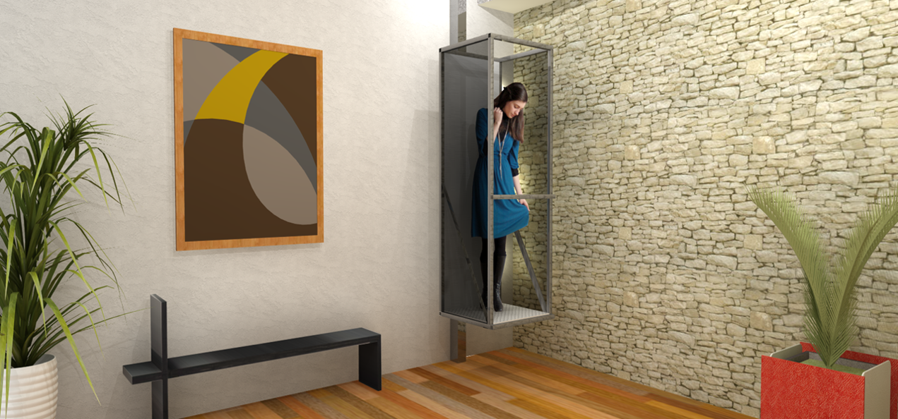
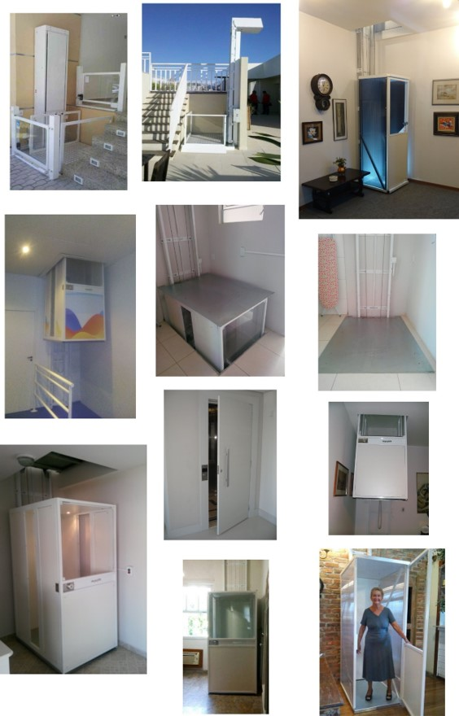
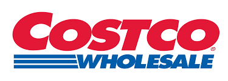
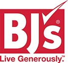
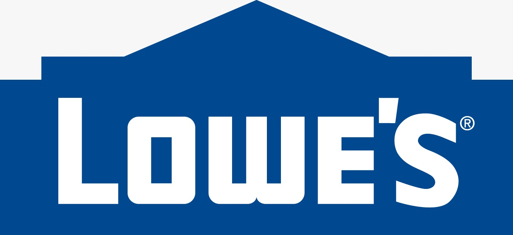
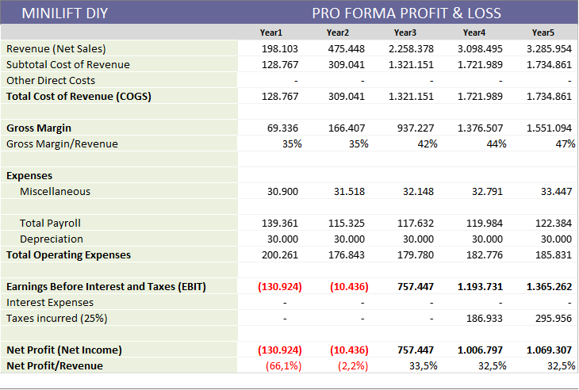
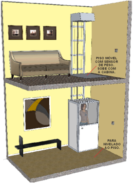
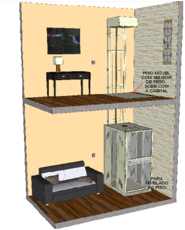

    
    <a href="#english">English</a>
    ·
    <a href="#spanish">Spanish</a>
    ·
    <a href="#portuguese">Portuguese</a>
    ·
    <a href="#chinese">Chinese</a>

 

### MINILIFT-DIY - EXECUTIVE SUMMARY 
Summary of the 2020 fundraising roadshow.  

### The oportunity
The company Exxponential LLC imports and installs **MiniLift** in the USA, a line of compact two-stop residential elevators, **revolutionary** for its **simplicity**, **efficiency**, **low power consumption energy** and **low environmental impact**.

The company has found very good acceptance of the equipment in the American market, which can be confirmed with a Net Promoter Score (NPS) indicator above 8 among its customers.    

    

<em>MiniLift operation videos: <a href="https://www.youtube.com/watch?v=fyCBqfOozSE">Video 1</a> | <a href="https://www.youtube.com/watch?v=Z8eDpxcq_ac">Video 2</a> | <a href="https://www.youtube.com/watch?v=ATkJ6oD_d_s">Video 3</a>.</em>

 

The good reception of MiniLift in the USA is explained by several factors, among them:
- The growing market for **individual accessibility**, driven by the elderly and the disabled, including veterans of war;
- Population dispersion and high incidence of two-story houses;
- The excellent relationship between price and benefit, when compared to the other individual accessibility options available on the market.     

<em>Distribution of the 65+ population in the USA.</em>

  

All of these factors point to a promising growth of Exxponential LLC and an increasing **popularization of the concept** of accessibility of the MiniLift line in the coming years. However, after the first year of operation in the USA, the entrepreneurs at the head of the business found that a significant part of the final price of the equipment is a result of the aggregate cost to install the equipment.

**Installation**  
The installation of Minnilift is a very quick and simple operation, but one that often involves some **logistical complexity** when it requires **travel** and **accommodation** of technicians, especially for the interior regions of the states.    

<em>Equipment installed in the USA.</em>

  

### The business
On the one hand, the price of the elevator is impacted by the costs of installing the equipment. On the other hand, the American market is very receptive to **“*do it yourself (DIY)*”**, a concept in which the customer assembles and installs a certain equipment in exchange for various benefits, including the reduction **price** and **personal satisfaction** for performing manual activity.

Faced with this scenario, entrepreneurs understand that an excellent business opportunity has been configured to be explored.

Over the past few months, they have researched and found viable ways to **adapt the current project** of the MiniLift line to the DIY modality and, thus, considerably reduce the price of the equipment to the final consumer.

The entrepreneurs then developed a business plan for the creation of the company **MiniLift-DIY**, specialized in distributing the MiniLift line in the DIY concept through the main **retail chains** in the USA, such as *Home Depot, Ace Hardware, Costco and BJs*.    

    
    
         
    
    

<em>Retail chain with great capilairade in the USA.</em>

 

Despite the focus on distributing the DIY model in retail chains, the new company intends to continue selling the elevator line in the traditional way, that is, it will continue to carry out installations and technical assistance for the equipment throughout the USA.

### The execution
The financial simulations of the business plan show that, with an **initial investment** of US $ 750,000, it is possible to reach an installed base of 700 elevators and **net revenues** of US $ 3.3 million (EBITDA 32% RL) in the **fifth year** of the company's operation.    

<em>Profit & loss of Minilift DIY operation between years 1 and 5.</em>

  

**Assumptions**  
The assumptions of **market share** consider the conservative estimate of distribution *only* in the four main retail chains mentioned above and of *only* an elevator model (Minilift NANO).

Together, these four retail chains add up to about 4,000 stores in the American territory, so that the estimated amount of sales in five years means that only 3.5% of the total stores will be able to sell one piece of equipment per year.

The simulations also used the following premises of **attraction** and **conversion**:  

**Lead capture assumptions in year 2**
- List price of the Minilift Nano DIY - US $ 11,500;
- Dealer discount - 20%
- Leads (type "SAL") generated in the year 2 - 800
- Conversion rate (SALES / SAL) - 5.0%
- Products sold in the year 2 - 40 

Obs.: *SAL = Sales accepted leads*   

**Sales growth assumptions**
- Sales growth (year 2-1) - 80.0%
- Sales growth (year 3-2) - 400.0%
- Sales growth (year 4-3) - 20.0%
- Sales growth (year 5-4) - 5.0%   

  

<em>Sales overview according to funding and growth assumptions.</em>

  

P&L simulations also considered the following premises:  

**Assumptions for costs and prices in year 2**
- Total direct cost of production (including freight) - $ 4,920
- Product return rate - 15%
- Rate of reuse of the returned product - 95%
- Sales taxes (VAT) - 0%   

### Company Startup
The company's startup, scheduled for the **first year** of operation, aims to:
- Start commercial operation in the city of Miami, FL;
- Finish the **DIY project** of the Minivator NANO model;
- Complete prototype production and carry out field tests;
- Start negotiations with retail chains;
- Promote the roadshow to raise funds for the next stage of the plan.    

    
    .
    

<em> Conceptual layout of the Minilift DIY line in the USA. </em>

 

### Funding 
All steps provided for in the business plan will be financed by **venture capital** and the main rule of thumb to attract investors is the **repurchase** of the shares by the original partners.

The objective of the **current roadshow** is to raise a target of US $ 250,000 as **seed capital** to effect the **startup** of the project in the first year of operation.  

**Expansion**  
In the next stage (Series A), the objective is to raise an additional US $ 500,000, divided into **two quotas** of US $ 250,000, with the purpose of:
- Finish the field tests of the Minilift DIY models;
- Renegotiate contractual terms with retail chains;
- **Manufacture** and import **minimum inventory** to the USA capable of meeting demand safely;

The funding of **Seed capital** and **Series A** published at <a href="https://www.crunchbase.com/organization/minilift-diy#section-overview"> Crunch Base </a> consider Exxponential LLC's *prior valuation* of $ 11.3 million for the company.

...

*1. The "Non Disclousure Agreement" for access to the business plan's **executive summary** is available to investors interested in <a href="https://github.com/ExxponentialLLC/miniliftDIY/NDA-MiniliftDIY-Exxponential.pdf" target="_blank">MiniliftDIY NDA</a>.*

 

    
    <a href="#english">English</a>
    ·
    <a href="#spanish">Spanish</a>
    ·
    <a href="#portuguese">Portuguese</a>
    ·
    <a href="#chinese">Chinese</a>

##  
                         
                         
                         
                         

 
 

### MINILIFT-DIY - RESUMEN EJECUTIVO
Resumen del roadshow de recaudación de fondos de 2020.

### La oportunidad
La compañía Exxponential LLC importa e instala **MiniLift** en los EE. UU., Una línea de elevadores residenciales compactos de dos paradas, **revolucionaria** por su **simplicidad**, **eficiencia**, **bajo consumo de energía energía** y **bajo impacto ambiental**.

La compañía ha encontrado una muy buena aceptación de los equipos en el mercado estadounidense, que se puede probar con un indicador de Net Promoter Score (NPS) superior a 8 entre sus clientes.    

    

<em> Videos de la operación MiniLift: <a href="https://www.youtube.com/watch?v=fyCBqfOozSE"> Video 1 </a> | <a href="https://www.youtube.com/watch?v=Z8eDpxcq_ac"> Video 2 </a> | <a href="https://www.youtube.com/watch?v=ATkJ6oD_d_s"> Video 3 </a>. </em>

 

La buena recepción de MiniLift en los Estados Unidos se explica por varios factores, entre ellos:
- El creciente mercado de **accesibilidad individual**, impulsado por los ancianos y los discapacitados, incluidos los veteranos de guerra;
- Dispersión de la población y alta incidencia de casas de dos pisos;
- La excelente relación entre precio y beneficio, en comparación con las otras opciones de accesibilidad individual disponibles en el mercado.    

<em> Distribución de la población de más de 65 años en los Estados Unidos. </em>

 

Todos estos factores apuntan a un crecimiento prometedor de Exxponential LLC y una creciente **popularización del concepto** de accesibilidad de la línea MiniLift en los próximos años. Sin embargo, después del primer año de operación en los EE. UU., Los empresarios al frente del negocio descubrieron que una parte significativa del precio final del equipo es el resultado del costo agregado para instalar el equipo.

**Instalación**  
La instalación de Minnilift es una operación muy rápida y simple, pero que a menudo implica cierta **complejidad logística** cuando requiere **viajes** y **alojamiento** de técnicos, especialmente para las regiones interiores de los estados.    

<em> Equipo instalado en los EE. UU. </em>

 

### El negocio
Por un lado, el precio del elevador se ve afectado por los costos de instalación del equipo. Por otro lado, el mercado estadounidense es muy receptivo a **"*hágalo usted mismo (DIY)*"**, un concepto en el que el cliente ensambla e instala un cierto equipo a cambio de diferentes beneficios, incluida la reducción **precio** y **satisfacción personal** por realizar actividad manual.

Frente a este escenario, los empresarios entienden que se ha configurado una excelente oportunidad de negocio para ser explorada.

En los últimos meses, han investigado y encontrado formas viables de **adaptar el proyecto actual** de la línea MiniLift a la modalidad de bricolaje y, por lo tanto, reducir considerablemente el precio del equipo para el consumidor final.

Luego, los empresarios desarrollaron un plan de negocios para la creación de la compañía **MiniLift-DIY**, especializada en distribuir la línea MiniLift en el concepto de bricolaje a través de las principales **cadenas minoristas** en los EE. UU., Como *Home Depot, Ace Hardware, Costco y BJs*.    

    
    
         
    
    

<em> Cadena minorista con gran capilairade en los EE. UU. </em>

 

A pesar del enfoque en la distribución del modelo de bricolaje en las cadenas minoristas, la nueva compañía tiene la intención de continuar vendiendo la línea de elevadores de la manera tradicional, es decir, continuará llevando a cabo instalaciones y asistencia técnica para el equipo en todo Estados Unidos.

### La ejecución
Las simulaciones financieras del plan de negocios muestran que, con una **inversión inicial** de US $ 750,000, es posible alcanzar una base instalada de 700 ascensores e **ingresos netos** de US $ 3.3 millones (EBITDA 32% RL) en el **quinto año** de la operación de la compañía.    

<em> Ganancias y pérdidas de la operación Minilift DIY entre los años 1 y 5. </em>

 

### Financiamiento
Todos los pasos previstos en el plan de negocios serán financiados por **capital de riesgo** y la principal regla general para atraer inversores es la **recompra** de las acciones por parte de los socios originales.

El objetivo del **roadshow actual** es recaudar $ 250,000 como objetivo **capital semilla** para:
- Completa el **proyecto de adaptación** para el modelo DIY;
- Iniciar negociaciones con cadenas minoristas;
- Desarrollar el plan de negocios y promover el roadshow para recaudar fondos para la próxima etapa del plan.   

    
    .
    
 
 
 

<em> Esquema conceptual de la línea Minilift DIY en EE. UU. </em>

 

En la siguiente etapa (Serie A), el objetivo es recaudar US $ 500,000 adicionales, divididos en **dos cuotas** de US $ 250,000, con el propósito de:
- Iniciar operaciones comerciales en la ciudad de Miami, FL;
- Termine las pruebas de campo de los modelos Minilift DIY;
- Concluir negociaciones con cadenas minoristas;
- **Fabricación** e importación **inventario mínimo** a EE. UU. Capaz de satisfacer la demanda de manera segura;

El rasing de **seed capital** y **Serie A** publicada en <a href="https://www.crunchbase.com/organization/minilift-diy#section-overview">Crunch Base</a> considere la valuación previa *de Exxponential LLC* de $ 11.3 millones para la compañía.

... 

 

*1. El "Acuerdo de no divulgación" para el acceso al **resumen ejecutivo** del plan de negocios está disponible para inversores interesados en <a href="http://bit.ly/NDA-OpenPBL">MiniliftDIY NDA</a>.*

 

    
    <a href="#english">English</a>
    ·
    <a href="#spanish">Spanish</a>
    ·
    <a href="#portuguese">Portuguese</a>
    ·
    <a href="#chinese">Chinese</a>

##  
                         
                         
                         
                         

 
 

## MINILIFT-DIY - SUMÁRIO EXECUTIVO

### A oportunidade 
A empresa Exxponential LLC importa e instala nos USA a **MiniLift**, uma linha de elevadores residenciais compactos de duas paradas, **revolucionários** por sua **simplicidade**, **eficácia**, **baixo consumo de energia** e **baixo impacto ambiental**.

A empresa tem encontrado uma aceitação muito boa dos equipamentos no mercado americano, o que pode ser comprovado com um indicador Net Promoter Score (NPS) acima de 8 entre seus clientes.  

    

<em>Videos do funcionamento do Minilift:  <a href="https://www.youtube.com/watch?v=fyCBqfOozSE">Vídeo 1</a> | <a href="https://www.youtube.com/watch?v=Z8eDpxcq_ac">Vídeo 2</a> | <a href="https://www.youtube.com/watch?v=ATkJ6oD_d_s">Vídeo 3</a>.</em>

 

A boa receptividade do MiniLift nos USA é explicada por diversos fatores, entre eles:
- O crescente mercado de **acessibilidade individual**, puxado por idosos e portadores de deficiência, entre estes, os veteranos de guerra;
- A dispersão populacional e alta incidência de casas de dois andares;
- A ótima relação entre preço e benefício, se comparado com as demais opções de acessibilidade individual disponíveis no mercado.     

<em>Distribuição da população 65+ nos USA.</em>

  

Todos esses fatores apontam para um crescimento promissor da Exxponential LLC e uma crescente **popularização do conceito** de acessibilidade da linha MiniLift nos próximos anos. 

**Normas**  
Os elevadores da linha Minilift se enquandram nas normas americanas de acessibilidade vertical.  

**Instalação**  
A instalação do Minilift é uma operação bastante rápida e simples, mas que, frequentemente, envolve alguma **complexidade logística** quando exige **deslocamentos** e **hospedagens** de técnicos, sobretudo para as regiões do interior dos estados.  

<em>Equipamentos instalados no USA.</em>

  

**Do It Yourself - DIY**  
Após o primeiro ano de operação nos USA, os empreendedores à frente do negócio constataram que uma parte significativa do preço final do equipamento é resultado do custo agregado para a **instalar** o equipamento.

Se por um lado o preço do elevador é impactado pelos custos de instalação do equipamento. Por outro lado, o mercado americano é bastante receptivo ao **“ *do it yourself (DIY)* ”**, conceito no qual o próprio cliente monta e instala um determinado equipamento em troca de benefícios diversos, entre eles a **redução do preço** e a **satisfação pessoal** por realizar a atividade manual.

Ao longo dos últimos meses, eles pesquisaram e encontraram formas viáveis de **adaptar o projeto atual** da linha MiniLift para a modalidade DIY e, assim, reduzir consideravelmente o preço do equipamento ao consumidor final.  

    
    .
    

<em>Esquema conceitual da linha Minilift DIY nos USA.</em>

 

### O negócio
Diante deste cenário, os empreendedores entendem que configurou-se uma excelente oportunidade de negócios a ser explorada. Elaboraram então um **plano de negócios** para a criação da empresa **MiniLift-DIY**, especializada em comercializar a linha MiniLift no conceito DIY nos USA. 

**Distribuição**  
A estratégia de distribução utiliza as principais **redes de varejo** dos USA, tais como *Home Depot, Ace Hardware, Costco, Lowe's and BJs*.  

    
    
         
    
    

<em>Rede de varejo com grande capilaridade nos USA.</em>

 

Apesar do foco na distribuição do modelo DIY nas redes de varejo, a nova empresa pretende continuar comercializando a linha de elevadores da forma tradicional, ou seja, continuará executando instalações e assistência técnica do equipamento em todo território dos USA.  

### A execução do plano 
As simulações financeiras do plano de negócios mostram que, com um **investimento inicial** de US $ 750.000, é possível atingir uma base instalada de 800 elevadores e **receitas líquidas** de US $ 3,3 milhões (EBITDA 32% RL) no **quinto ano** de operação da empresa.   

<em>Profit & loss da operação da Minilift DIY entre os anos 1 e 5.</em>

 

**Premissas**  
As premissas de **participação de mercado** consideram a estimativa conservadora de distribuição *apenas* nas quatro principais redes de varejo citadas anteriormente e de *apenas* um modelo de elevador (Minilift NANO). 

Juntas, estas quatro redes de varejo somam cerca de 4.000 lojas no território Americano, de forma que quantidade estimada de vendas em cinco anos significa que apenas 3,5% do total da lojas irá consiguir vender um equipamento por ano.  

As simulações utilizaram ainda as seguintes premissas de **atração** e **conversão** no ano 2:
- Preço de tabela do Minilift Nano DIY - US $ 11.266;
- % de desconto para o revendedor - 20% 
- Lojas de varejo (total) - 4.000
- Taxa de atração de pelo menos um LEAD por ano - 20% das lojas   
- Leads (tipo "SAL") gerados no ano 2 - 800
- Taxa de conversão (VENDAS/SAL) - 5,0% 
- Produtos vendidos no ano 2 – 90 equipamentos 

Obs.: *SAL = Sales Accepted leads*   

  

<em>Panorama das vendas de acordo com as premissas de captação e crescimento.</em>

 

As simulações do DRE consideraram ainda as seguintes premissas: 

**Premissas de custos e preços no ano 2**
- Custo direto total de produção (incluindo frete) - US $ 4.920 
- Taxa de *devolução* do produto - 15%
- Taxa de reaproveitamento do produto devolvido - 95%
- Impostos sobre a venda (IVA) – 0 %   

### Startup da empresa
O *startup* da empresa, previsto para o **primeiro ano** de operação, tem como objetivos:
- Iniciar a operação comercial na cidade de Miami, FL;
- Concluir o **projeto de adaptação DIY** do modelo Minivator NANO; 
- Produzir **um protótipo** para testes de campo;
- Produzir **três protótipos** para showroom;
- Produzir **dez unidades** para estoque inicial; 
- Iniciar as negociações e fechar contrato com **pelo menos uma** rede de varejo; 
- Promover o roadshow para a captação de recursos para a etapa seguinte do plano de negócios.   

### Financiamento
Todas as etapas previstas no plano de negócios serão financiadas por **capital de risco** e a principal regra de saída para atrair investidores é a **recompra** das participações pelos sócios originais.  

**Seed capital**   
O objetivo do **atual roadshow** é a captação alvo de US $ 250.000 a título de **seed capital** para efetuar o **startup** do empreendimento no primeiro ano de operação.  

**Series A**   
Na etapa seguinte, Series A, o objetivo é captar mais US $ 500.000, divididos em **duas quotas** de US $ 250.000, com a finalidade de:
1. Concluir o **projeto de adaptação DIY** do modelo Minivator HC (cadeira de rodas); 
2. Fechar contrato com mais **quatro** redes de varejo nos USA; 
3. **Fabricar** e importar para os USA um **estoque mínimo** capaz de atender a demanda com segurança;  

**Valuation**   
A captação do **Seed capital** e da **Series A** publicada em <a href="https://www.crunchbase.com/organization/minilift-diy#section-overview">Crunch Base</a> consideram a *pre money valuation* em US $ 11,3 milhões.

... 

*1. O Non Disclousure Agreement para acesso ao **sumário executivo** do plano de negócios está disponível para investidores interessados em <a href="http://bit.ly/NDA-OpenPBL">MiniliftDIY 2020.1 NDA</a>.*

 

    
    <a href="#english">English</a>
    ·
    <a href="#spanish">Spanish</a>
    ·
    <a href="#portuguese">Portuguese</a>
    ·
    <a href="#chinese">Chinese</a>

##  
                         
                         
                         
                         

 
 

### MINILIFT-DIY-经营理念
2020年筹款路演摘要。

...
（很快也有中文版本）
...

*1。 对<a href="http://bit.ly/NDA-OpenPBL"> MiniliftDIY NDA </a>感兴趣的投资者可以使用“非公开协议”来访问业务计划的“执行摘要”*

*2。 有关OpenPBL专业学校的更多详细信息，请参见其标准产品的<a href="https://jorgecataldo.github.io/OpenPBL-Storytelling/#chinese">讲故事</a>（仅提供葡萄牙语版本）*

 

    
    <a href="#english">English</a>
    ·
    <a href="#spanish">Spanish</a>
    ·
    <a href="#portuguese">Portuguese</a>
    ·
    <a href="#chinese">Chinese</a>

##  
                         
