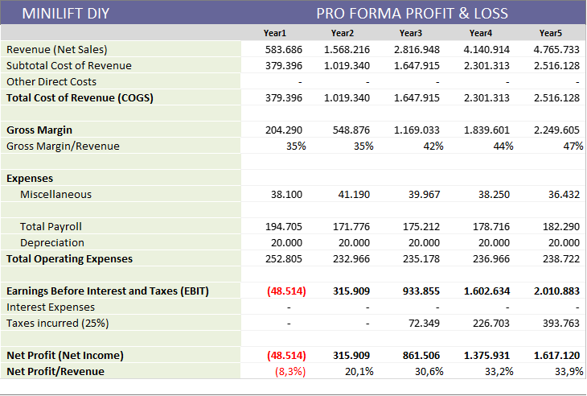

    
    <a href="#english">English</a>
    ·
    <a href="#spanish">Spanish</a>
    ·
    <a href="#portuguese">Portuguese</a>
    ·
    <a href="#chinese">Chinese</a>

 

### MINILIFT-DIY EXECUTIVE SUMMARY 
Summary of the 2020 fundraising roadshow.  

**THE OPPORTUNITY AND THE PROPOSAL**  
Companies a

**BUSINESS AND EXECUTION**  
The innovative 

**FINANCING**  
All expansion 1

...

*1. The "Non Disclousure Agreement" for access to the business plan's **executive summary** is available to investors interested in <a href="http://bit.ly/NDA-OpenPBL">MiniliftDIY NDA</a>.*

 

    
    <a href="#english">English</a>
    ·
    <a href="#spanish">Spanish</a>
    ·
    <a href="#portuguese">Portuguese</a>
    ·
    <a href="#chinese">Chinese</a>

##  
                         
                         

 
 

### MINILIFT-DIY - 
Resumen del roadshow de recaudación de fondos de 2020.

**...**

(Pronto también disponible en la versión en español)
...

*1. El "Acuerdo de no divulgación" para el acceso al **resumen ejecutivo** del plan de negocios está disponible para inversores interesados en <a href="http://bit.ly/NDA-OpenPBL">MiniliftDIY NDA</a>.*

 

    
    <a href="#english">English</a>
    ·
    <a href="#spanish">Spanish</a>
    ·
    <a href="#portuguese">Portuguese</a>
    ·
    <a href="#chinese">Chinese</a>

##  
                         
                         

 
 

## MINILIFT-DIY - SUMÁRIO EXECUTIVO 

### A oportunidade 
A empresa Exxponential LLC importa e instala nos USA a **MiniLift**, uma linha de elevadores residenciais compactos de duas paradas, **revolucionários** por sua **simplicidade**, **eficácia**, **baixo consumo de energia** e **baixo impacto ambiental**.

A empresa tem encontrado uma aceitação muito boa dos produtos no mercado americano, o que pode ser comprovado com um indicador Net Promoter Score (NPS) acima de 8 entre seus clientes.  

    

<em><a href="https://youtube.com">Vídeo</a> do funcionamento do MiniLift Nano.</em>

 

A boa receptividade do MiniLift nos USA é explicada por diversos fatores, entre eles:
- O crescente mercado de **acessibilidade individual**, puxado por idosos e portadores de deficiência, entre estes, os veteranos de guerra;
- A dispersão populacional e alta incidência de casas de dois andares;
- A ótima relação entre preço e benefício, se comparado com as demais opções de acessibilidade individual disponíveis no mercado.     

<em>Distribuição da população 65+.</em>

  

Todos esses fatores apontam para um crescimento promissor da Exxponential LLC e uma crescente **popularização do conceito** de acessibilidade da linha MiniLift nos próximos anos. Entretanto, após o primeiro ano de operação nos USA, os empreendedores à frente do negócio constataram que uma parte significativa do preço final do equipamento é resultado do custo agregado para a instalar o equipamento. 

**Instalação**  
A instalação do Minnilift é uma operação bastante rápida e simples, mas que, frequentemente, envolve alguma **complexidade logística** quando exige **deslocamentos** e **hospedagens** de técnicos, sobretudo para as regiões do interior dos estados.  

<em>Equipamentos instalados no USA.</em>

  

**A proposta**   
Por outro lado, o mercado americano é bastante receptivo ao conceito **“ *do it yourself (DIY)* ”**, no qual o próprio cliente monta e instala um determinado equipamento em troca da **redução do preço** e da **satisfação pessoal** por realizar a atividade manual.

### O negócio
Diante deste cenário, os empreendedores entendem que configurou-se uma excelente oportunidade de negócios. Ao longo dos últimos meses, eles pesquisaram e encontraram formas viáveis de **adaptar o projeto atual** da linha MiniLift para a modalidade DIY e, assim, reduzir consideravelmente o preço do equipamento ao consumidor final.  

Os empreendedores elaboraram um plano de negócios para a criação da empresa **MiniLift-DIY**, especializada em distribuir a linha MiniLift no conceito DIY através das principais **redes de varejo** dos USA, tais como *Home Depot, Ace Hardware, Costco and BJs*.  

    
    
         
    

<em>Rede de varejo com grande capilairade nos USA.</em>

 

Apesar do foco na distribuição do modelo DIY nas redes de varejo, a nova empresa pretende continuar comercializando a linha de elevadores da forma tradicional, ou seja, continuará executando instalações e assistência técnica do equipamento em todo território dos USA.

### A execução
As simulações financeiras do plano de negócios mostram que, com um **investimento inicial** de US $ 750.000, é possível atingir uma base instalada de 700 elevadores e **receitas líquidas** de US $ 3,3 milhões (EBITDA 32% RL) no **quinto ano** de operação da empresa.   

<em>Profit & loss da operação da Minilift DIY entre os anos 1 e 5.</em>

  

### Financiamento
Todas as etapas de expansão previstas no plano serão financiadas por **capital de risco** e a principal regra de saída para atrair investidores é a **recompra** das participações pelos sócios originais. 

O objetivo do atual roadshow é a captação alvo de US $ 750.000, dividida em **cinco quotas** de US $ 150.000, com a finalidade de:
- Iniciar a operação comercial na cidade de Miami, FL;
- Concluir o **projeto** de adaptação para o modelo DIY;
- Iniciar as negociações com as redes de varejo;
- **Fabricar** e importar para os USA um **estoque mínimo** capaz de atender a demanda com segurança;

    
    .
    

<em>Linha Minilift DIY nos USA.</em>

 

A captação da **Series A** publicada em <a href="https://www.crunchbase.com/organization/minilift-diy#section-overview">Crunch Base</a> considera a *valuation* prévia de US $ 11,3 milhões para a empresa.

... 

*1. O Non Disclousure Agreement para acesso ao **sumário executivo** do plano de negócios está disponível para investidores interessados em <a href="http://bit.ly/NDA-OpenPBL">MiniliftDIY 2020.1 NDA</a>.*

 

    
    <a href="#english">English</a>
    ·
    <a href="#spanish">Spanish</a>
    ·
    <a href="#portuguese">Portuguese</a>
    ·
    <a href="#chinese">Chinese</a>

##  
                         
                         

 
 

### MINILIFT-DIY-经营理念
2020年筹款路演摘要。

...
（很快也有中文版本）
...

*1。 对<a href="http://bit.ly/NDA-OpenPBL"> MiniliftDIY NDA </a>感兴趣的投资者可以使用“非公开协议”来访问业务计划的“执行摘要”*

*2。 有关OpenPBL专业学校的更多详细信息，请参见其标准产品的<a href="https://jorgecataldo.github.io/OpenPBL-Storytelling/#chinese">讲故事</a>（仅提供葡萄牙语版本）*

 

    
    <a href="#english">English</a>
    ·
    <a href="#spanish">Spanish</a>
    ·
    <a href="#portuguese">Portuguese</a>
    ·
    <a href="#chinese">Chinese</a>

##  
                         
