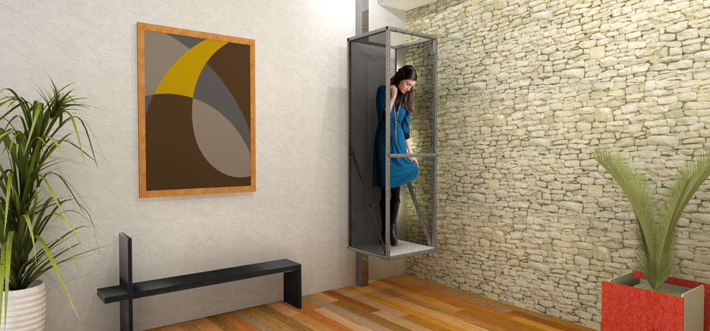

 

## MINILIFT DEALER PAGE

  

### MINILIFT USA
The company **Exxponential LLC** imports and installs **MiniLift** elevators in the USA, a line of compact two-stop residential elevators, **revolutionary** as a result of **simplicity**, **efficiency**, **low energy consumption** and **low environmental impact**. 

Watch some videos with the equipment in operation.   

    

<em>videos with the MiniLift in operation: <a href="https://www.youtube.com/watch?v=ATkJ6oD_d_s" target="_blank">Video 1</a> | <a href="https://www.youtube.com/watch?v=Z8eDpxcq_ac" target="_blank">Video 2</a> | <a href="https://www.youtube.com/watch?v=fyCBqfOozSE" target="_blank">Video 3</a>.</em>

 

**Acceptance of American users**  
The company has had exceptional acceptance of its products in the American market, which is confirmed with a Net Promoter Score (NPS) indicator of over 8 among its customers.

The positive response to MiniLift in the USA is as a result of several factors, including:
- The growing market for **individual accessibility**, driven by the elderly and the disabled, and US Veterans.
- Population dispersion and the large number of two-story houses;
- The major advantage of excellent value for money and benefits when compared to the other individual accessibility options available in the market.    

<em>Distribution of the 65+ population in the USA.</em>

  

This means that there will be substancial growth for home accessibility options throughout the USA and the Minilift line will be in much grather demand in the coming years, promising exceptional growth opportuninies for Exxponential LLC.   

**Safety Standards**  
**User safety** is the main concern of the Minilift engineering team. Minilift elevators meet **all American vertical accessibility standards**. In particular, the Minilift line fits to the **DoJ's ADA (Americans with Disabilities Act)** ruled by the **2010 ADA Standards for Accessible Design**.

The "2010 ADA Standards" set the minimum requirements -both scoping and technical- for *"newly designed and constructed or altered State and local government facilities, public accommodations, and commercial facilities to be readily accessible to and usable by individuals with disabilities"*.   

    
    .
    

<em>2010 ADA conceptual layout of the Minilift line in the USA.</em>

 

*Note: See the full standard at <a href="https://exxponentialllc.github.io/miniliftDIY/2010ADAStandards.pdf" target="_blank">2010 ADA Standards for Accessible Design</a>*.

 

**Minilift installation**  
The installation of a Minilift elevator is a very quick and simple operation. The **civil work** to prepare for the installation of the equipment is also very simple.

The execution of the civli work is the client's responsibility and basically consists of:
- Drill a square hole between the two floors served by Minilift;
- Install a 220V power supply (the same type as the electric power sources for air conditioning equipment).

During the execution of civil works, **clients receive technical advice** with all the necessary guidelines for contracting the services of the **contractors**.

The installation often involves some **logistical complexity** when it requires **travel** and **accommodation** for technicians throughout the United States.    

<em>Some equipments installed in the USA.</em>

  

### MINILIFT DEALERS 

**MiniLift Authorized Resellers**
MiniLift Authorized Resellers are responsible for acquiring customers and installing equipment in their **acting regions**. The authorized resellers are remunerated for their performance both in the **sale process** and the **installation process**. 

The following list details the tasks of the dealers, as well as the percentage that each task represents to the total **resseller remuneration*.

  

**Pre-sale process**

LEAD GENERATION (20%)
- Local marketing 
- Product communication actions 
- 'Cold calls' and meetings 
- Leads' qualification   

TECHNICAL CONTACT (20%)
- Meeting calls (and visits if its need) 
- Information gathering
- Commercial proposal writing 

PROSPECT CONVINCING (50%)
- Sending the commercial proposal 
- Meeting calls 
- Emails exchanges 
- Negotiation
- Gathering the formal customer’s confirmation 

ORDER (10%) 
- Filling the technical sheet 
- writing the pre order fabrication

  

**After sales process**

INSTALLATION
- Advice for the preparatory civil works;
- Receiving and checking the Minilift package kit;
- Assembling the equipment;
- Elaborating the performance tests;
- Filling the feedback report;

TECHNICAL MAINTENANCE 
- Preventive or corrective maintenance;

 

**MiniLift consultants**   
Minilift consultants are partners, remunerated for performing part of the tasks described above under the responsibility of the dealers. For example, an architect can perform **lead generation** and **prospect convincing** of a sale and receive 70% of commercial commission if the sale is actually made.

 

**Price and commercial conditions**  
The prices of the Minilift two-stop elevators basically depend on the size of the cab. It is possible to order from a Minilift elevator with a cab for a single person to two people plus a wheelchair. The lowest-priced model costs about $ 15,000, installation services included.

Usualy, the payment is divided into three installments. The first installment is paid upon closing the contract, a second installment is paid on delivery of the equipment to the customer's home and a last installment is paid at the end of the installation of the equipment.

The commissioning of the dealers and concultants is paid in the same proportion as the division of the installments.

  

### WHAT'S NEXT

**New Minilift design**  
In response to our customers' requests, we are developing a new design for the cabins of the Minilift product line. The new cabs will soon be available for sale.  

  

<em>Studies for a new cab design.</em>

 

**Do It Yourself - DIY**  
Significant part of the final price of the equipment is a result of the aggregate cost to **install** the equipment. So we have researching viable ways to **adapt the current project** of the MiniLift line to the DIY modality and, thus, considerably reduce the price of the equipment to the final consumer.

The Minilift DIY line distribution strategy will use **authorized distributors** in the USA, including **retail stores**, **contractors** and **architects**.

Despite the focus on distributing the DIY model in retail stores, the new company intends to continue selling the elevator line in the traditional way, that is, it will continue to carry out installations and technical assistance for the equipment throughout the USA.  

##  

See the frequent asked questions about Minilift visiting <a href="https://minilift-usa.com/faq/" target="_blank">Minilift FAQ</a>.

If you want to be a Minilift consultant or dealer, please contact us to the phone ** ***-******. 

 

    
    <a href="#start">Go to the top</a>

##  

