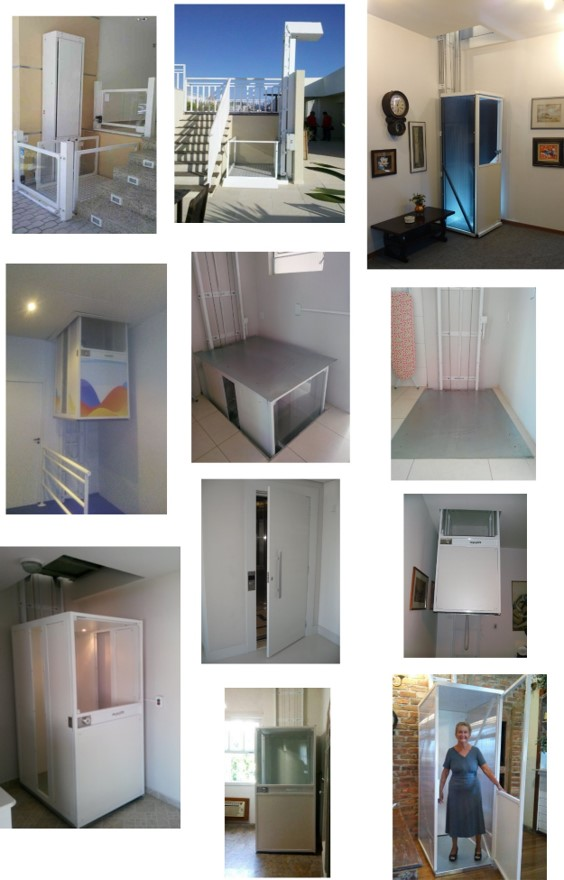

 

## MINILIFT DEALER'S PAGE  

### The oportunity
**Exxponential LLC** imports and installs **MiniLift** in the USA, a line of compact two-stop residential elevators, **revolutionary** by **simplicity**, **efficiency**, **low power consumption energy** and **low environmental impact**. Watch some videos with the equipment in operation.   

    

<em>videos with the MiniLift in operation: <a href="https://www.youtube.com/watch?v=ATkJ6oD_d_s" target="_blank">Video 1</a> | <a href="https://www.youtube.com/watch?v=Z8eDpxcq_ac" target="_blank">Video 2</a> | <a href="https://www.youtube.com/watch?v=fyCBqfOozSE" target="_blank">Video 3</a>.</em>

 

**Acceptance**  
The company has found very good acceptance of the equipment in the American market, which can be confirmed with a Net Promoter Score (NPS) indicator above 8 among its customers. 

The good reception of MiniLift in the USA is explained by several factors, among them:
- The growing market for **individual accessibility**, driven by the **elderly** and the **disabled**, including veterans of war;
- Population dispersion and high incidence of **two-story houses**;
- The excellent relationship between **price** and benefit, when compared to the other individual accessibility options available on the market.     

<em>Distribution of the 65+ population in the USA.</em>

  

All of these factors point to a promising growth of Exxponential LLC and an increasing **popularization of the concept** of accessibility of the MiniLift line in the coming years.   

**Safety standards**  
User safety is Minilift's primary concern. Minilift line elevators meet all American vertical accessibility standards. In particular, the Minilift line fits into the DoJ's ADA (Americans with Disabilities Act) and the 2010 ADA Standards for Accessible Design "2010 Standards" or "Standards".

*The 2010 Standards set minimum requirements - both scoping and technical - for newly designed and constructed or altered State and local government facilities, public accommodations, and commercial facilities to be readily accessible to and usable by individuals with disabilities.*   

    
    .
    

<em>Conceptual layout of the Minilift line in the USA.</em>

Access the full standard at <a href="https://exxponentialllc.github.io/miniliftDIY/2010ADAStandards.pdf" target="_blank">210 ADA Standards for Accessible Design</a>.

 

**Installation**  
Installing Minilift is a very quick and simple operation.

The civil work to prepare for the installation of the equipment is also very simple. The work is the client's responsibility, but basically consists of:
- Drill a square hole between the two floors served by Minilift;
- Install a 220V source (of the same type as the electric power sources for air conditioning equipment).

During the execution of the civil works to install the Minilift, customers receive technical advice with all the necessary guidelines for contracting the services of the contractors.

Eventually the installation requires **travel** and **accommodation** of technicians, especially for the interior regions of the states. Some states also require prior license application from city governments.   

<em>Equipment installed in the USA.</em>

  

**Price**  
Installing Minilift is

  

### What's next

**New Minilift design**  
In response to our customers' requests, we are developing a new design for the cabins of the Minilift product line.  

  

<em>New cab design.</em>

 

**Do It Yourself - DIY**  
Significant part of the final price of the equipment is a result of the aggregate cost to **install** the equipment. So we have researching viable ways to **adapt the current project** of the MiniLift line to the DIY modality and, thus, considerably reduce the price of the equipment to the final consumer.

The Minilift DIY line distribution strategy will use **authorized distributors** in the USA, including **retail stores**, **contractors** and **architects**.

Despite the focus on distributing the DIY model in retail stores, the new company intends to continue selling the elevator line in the traditional way, that is, it will continue to carry out installations and technical assistance for the equipment throughout the USA.

### Minilift dealers
Minilift dealers are responsible for acquiring customers and installing equipment in their areas of operation. The dealers are remunerated for their performance in the **sale process** and **installation process**. The following is a list detailing the responsibilities of the dealers, as well as the percentage that each task represents in the total remuneration:

**Pre-sale process**

LEAD GENERATION (20%)
- Local marketing 
- Product communication actions 
- 'Cold calls' and meetings 
- Leads' qualification   

TECHNICAL CONTACT (20%)
- Meeting calls (and visits if its need) 
- Information gathering
- Commercial proposal writing 

CUSTOMER CONVINCING (50%)
- Sending the commercial proposal 
- Meeting calls 
- Emails exchanges 
- Negotiation
- Gathering the formal customer’s confirmation 

ORDER (10%) 
- Filling the technical sheet 
- writing the pre order fabrication

  

**After sales process**

INSTALLATION
- Preparatory works;
- Receiving and checking the kit;
- Assembling the equipment;
- Elaborating the performance tests;
- Filling the feedback report;

TECHNICAL MAINTENANCE 
- Preventive or corrective maintenance;

  

##  

Visit the Minilift page in <a href="https://minilift-usa.com/faq/" target="_blank">Minilift page</a>

Contact us by... 

 

    
    <a href="#start">Start</a>

##  
                         

