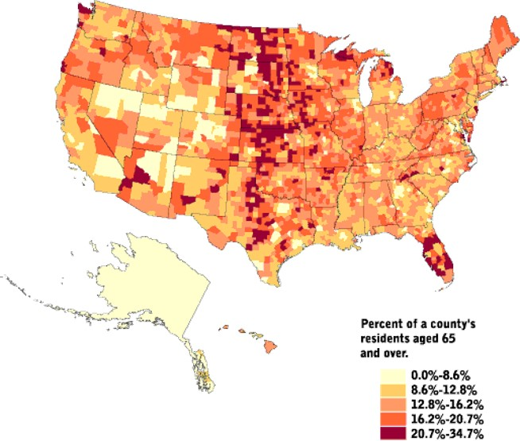
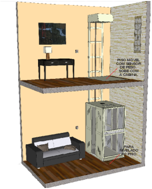
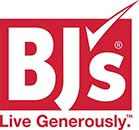
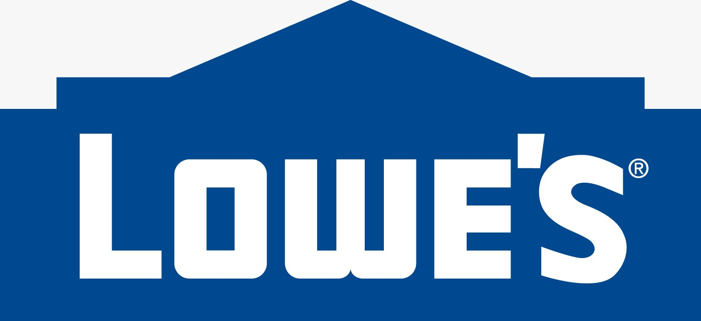
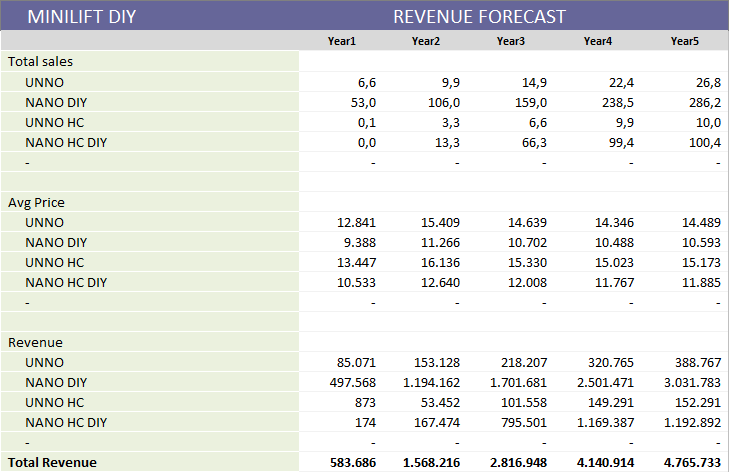

 

## MINILIFT DEALERS PAGE  

### The oportunity
The company Exxponential LLC imports and installs **MiniLift** in the USA, a line of compact two-stop residential elevators, **revolutionary** by **simplicity**, **efficiency**, **low power consumption energy** and **low environmental impact**.

The company has found very good acceptance of the equipment in the American market, which can be confirmed with a Net Promoter Score (NPS) indicator above 8 among its customers. 

Watch some videos with the equipment in operation.   

    

<em>MiniLift operation videos: <a href="https://www.youtube.com/watch?v=ATkJ6oD_d_s" target="_blank">Video 1</a> | <a href="https://www.youtube.com/watch?v=Z8eDpxcq_ac" target="_blank">Video 2</a> | <a href="https://www.youtube.com/watch?v=fyCBqfOozSE" target="_blank">Video 3</a>.</em>

 

The good reception of MiniLift in the USA is explained by several factors, among them:
- The growing market for **individual accessibility**, driven by the elderly and the disabled, including veterans of war;
- Population dispersion and high incidence of two-story houses;
- The excellent relationship between price and benefit, when compared to the other individual accessibility options available on the market.     

<em>Distribution of the 65+ population in the USA.</em>

  

All of these factors point to a promising growth of Exxponential LLC and an increasing **popularization of the concept** of accessibility of the MiniLift line in the coming years. 

**Standards**  
Minilift lifts meet all American standards for vertical accessibility.  

**Installation**  
The installation of Minilift is a very quick and simple operation, but one that often involves some **logistical complexity** when it requires **travel** and **accommodation** of technicians, especially for the interior regions of the states.    

<em>Equipment installed in the USA.</em>

  

### What's next

**New Minilift design**  
In response to our customers' requests, we are developing a new design for the cabins of the Minilift product line.  

  

<em>New cab design.</em>

  

**Do It Yourself - DIY**  
After the first year of operation in the USA, the entrepreneurs at the head of the business found that a significant part of the final price of the equipment is a result of the aggregate cost to **install** the equipment.

On the one hand, the price of the elevator is impacted by the costs of installing the equipment. On the other hand, the American market is very receptive to **“ *do it yourself (DIY)* ”**, a concept in which the customer assembles and installs a certain equipment in exchange for various benefits, including the reduction **price** and **personal satisfaction** for performing manual activity.

Over the past few months, they have researched and found viable ways to **adapt the current project** of the MiniLift line to the DIY modality and, thus, considerably reduce the price of the equipment to the final consumer.

    
    .
    

<em>Conceptual layout of the Minilift DIY line in the USA.</em>

 

Faced with this scenario, entrepreneurs developed a business plan for the creation of the company **MiniLift-DIY**, specialized in distributing the MiniLift line in the DIY concept through the USA. 

**Distribution**  
The distribution strategy uses the main **retail chains** in the USA, such as *Home Depot, Ace Hardware, Costco, Lowe's and BJs*.    

    
    
         
    
    

<em>Retail chain with great capilairade in the USA.</em>

 

Despite the focus on distributing the DIY model in retail chains, the new company intends to continue selling the elevator line in the traditional way, that is, it will continue to carry out installations and technical assistance for the equipment throughout the USA.

**Assumptions**  
The assumptions of **market share** consider the conservative estimate of distribution *only* in the four main retail chains mentioned above and of *only* an elevator model (Minilift NANO).

Together, these four retail chains add up to about 4,000 stores in the American territory, so that the estimated amount of sales in five years means that only 3.5% of the total stores will be able to sell one piece of equipment per year.

The simulations also used the following premises of **attraction** and **conversion** in the year 2:  
- Price list of the Minilift Nano DIY - US $ 11,266;
- % discount for the dealer - 20%
- Retail stores (total) - 4,000
- Attraction rate of at least one LEAD per year - 20% of stores
- Leads ("SAL" type) generated in year 2 - 3,750
- Conversion rate (SALES/SAL) - 3.0%
- Products sold in year 2 - 132 pieces of equipment (Retail + online)

Obs.: *SAL = Sales accepted leads*   

  

<em>Sales overview according to funding and growth assumptions.</em>

 

P&L simulations also considered the following premises:  

**Assumptions for costs and prices in year 2**
- Total direct cost of production (including freight) - $ 4,920
- Product return rate - 15%
- Rate of reuse of the returned product - 95%
- Sales taxes (VAT) - 0%   

### Company Startup
The company's startup, scheduled for the **first year** of operation, aims to:
- Start commercial operation in the city of Miami, FL;
- Complete the **DIY adaptation project** of the Minivator NANO model;
- Produce **a prototype** for field tests;
- Produce **three prototypes** for showroom;
- Produce **ten units** for initial stock;
- Start negotiations and close a contract with **at least one** retail chain;
- Promote the roadshow to raise funds for the next stage of the plan.   

...

*1. The "Non Disclosure Agreement" for access to the business plan's **executive summary** is available to investors interested in <a href="https://exxponentialllc.github.io/miniliftDIY/NDA-MiniliftDIY-Exxponential.pdf" target="_blank">MiniliftDIY NDA</a>.*

 

    
    <a href="#start">Start</a>

##  
                         

